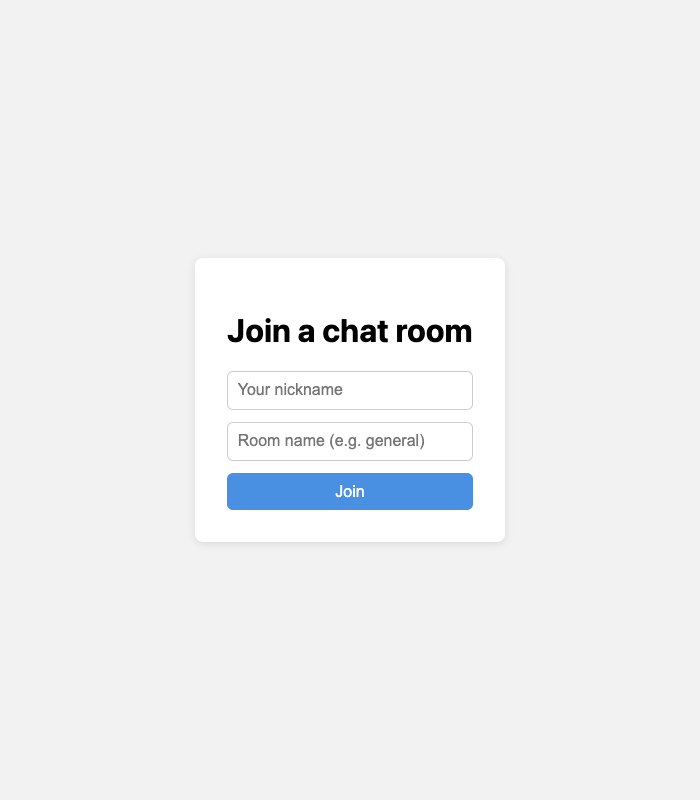
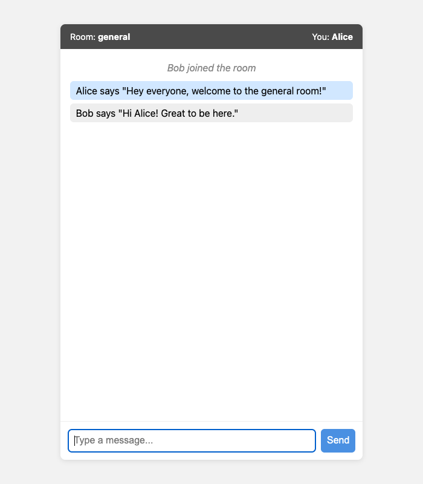
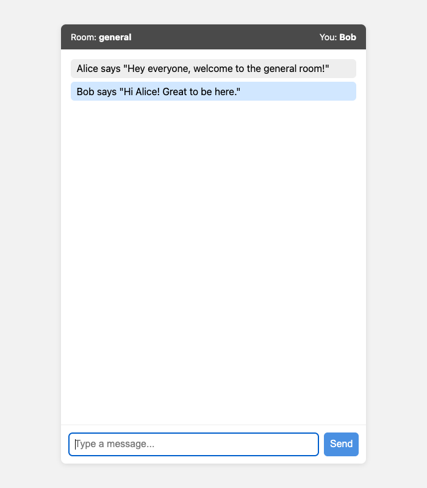
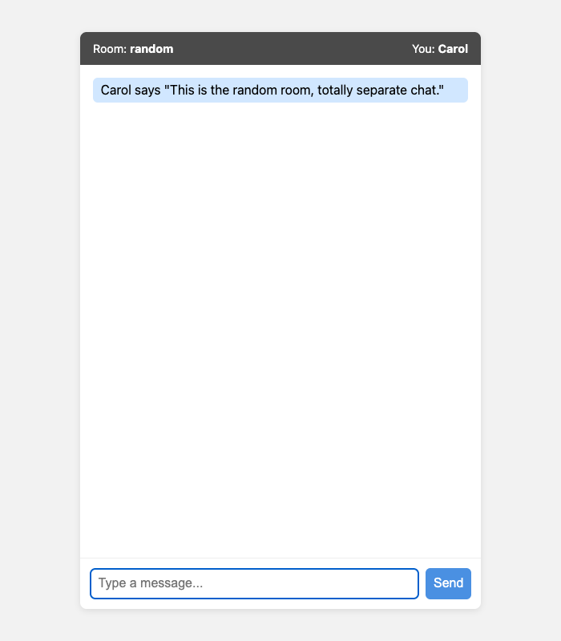

# Socket.IO Chat

A simple real-time chat app built while following the Socket.IO "Get Started" tutorial, then extended with nicknames and rooms.

## Features

- Real-time messaging with Socket.IO
- Nickname field, so messages show up as `Alice says "Hello"`
- Rooms: pick a room name when you join, messages only go to people in that room
- System messages when someone joins/leaves a room
- Built with ES modules (server and client both use `import`/`export`)

## Tech stack

- Node.js + Express
- Socket.IO
- Vanilla JS on the frontend (no framework), loaded as an ES module

## Project structure

```
server.js              server + socket handling
public/
  index.html            join screen + chat screen
  css/style.css
  js/client.js           client-side socket logic (ES module)
```

## Running it

```
npm install
npm start
```

Then open http://localhost:3000 in a couple of browser tabs, pick a nickname and a room, and start chatting.

## Namespaces vs rooms

Namespaces and rooms both split up traffic, but at different levels.

A **namespace** is a separate communication channel on top of the same connection, set up on the server with `io.of("/something")`. It's decided at connection time and doesn't change afterwards. Think of it as splitting the whole app into sections, e.g. `/chat` and `/admin`, each with its own events and its own set of connected clients.

A **room** is a lighter, dynamic grouping inside a namespace. A socket can join or leave rooms at any time with `socket.join()` / `socket.leave()`, and you can be in several rooms at once. This app uses rooms for exactly that: users can join a room, leave it, or (if I add it later) jump between rooms without reconnecting.

In this app, everything happens in the default namespace (`/`), and rooms are used for the actual chat rooms. Namespaces would make more sense if I wanted to split off a completely separate part of the app, e.g. a `/admin` namespace for moderators with different events, while the normal chat stays in the default namespace using rooms like it does now.

## Screenshots

Join screen:



Two users chatting in the "general" room:



Same room, Bob's view:



Carol in a different room ("random") - messages from "general" never show up here:


